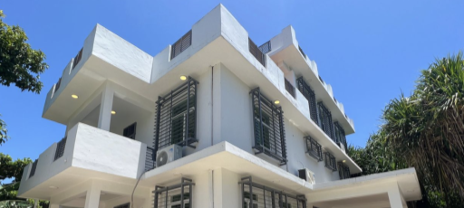

<!-- section 1 -->



 ## OurParadise: Zanzibar
 
 ### A Co-Living Community for Change-Makers & Digital Nomads

 On the west coast of Zanzibar sits a beautiful and historical short and long-term community space for eco-tourism, co-working, and co-living. A place for like-minded people to gather and build our future together.

  <button>[Support the Project](/action)</button>



<!-- section 2  -->



## Karibu Zanzibar

### Karibu means **"Welcome (to)"** in Swahili

Discover authentic paradise. Just ten minutes from Stone Town, a World Heritage Site, as well as the international airport.





#### **Jungle Paradise** @ Mbweni Ruins

For short term stays. A beachfront hotel that sits beside historical ruins, all surrounded by beautiful lush gardens featuring a wide variety of native and exotic plants.

 <button>[Info](/location/mbweni)</button>

|||

#### **Seaview Apartments**

For short and long-term stays. Two apartment buildings, with four three-bedroom spaces and one rooftop penthouse each. Private beach and direct access to Jungle Paradise.

 <button>[Info: Coming Soon](/)</button>





#### **OurOffice**

A three-floor office space for co-working and collaboration. Conveniently located just next to Jungle Paradise and Seaview Apartments.

 <button>[Info: Coming Soon](/)</button>

|||

#### **Chumbe Island** (Friends of the Project)

An award-winning private nature reserve, home to one of the world's most pristine coral reef sanctuaries. Day trips leave to Chumbe each day from our property.

<button>[Info](/location/chumbe)</button>





## Activities





### Experience

Experience an authentic paradise through relaxation, swimming, and garden explorations. Escape into a place where time slows down. Here, you are family.

|||

### Crafts

Coming 2023 | Learn from locals how to produce crafts, from ceramics to clothing and wood-working. In this way, we can promote and support the conservation of Zanzibari practices.

|||

### On the Water

Coming 2023 | Take a trip to a sand bank or a nearby island on one of our two sailing boats – one, a solar-equipped Turkish Gulet, and the other, a simple and fun catamaran.

