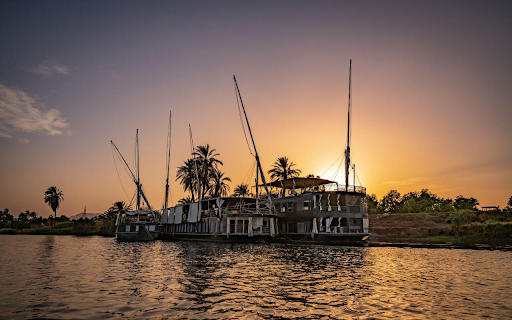
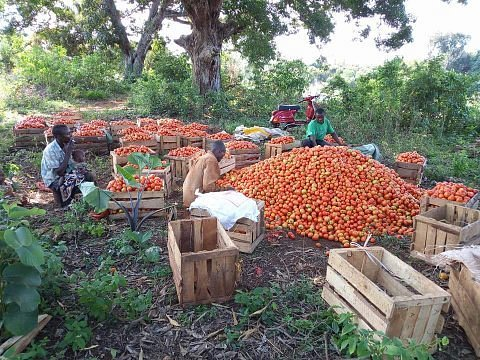

<!-- section 1 -->



 ## Welcome to OurParadise
 
 ### A Co-Owned Abundance-Based System

  

 Our mission is to conserve and protect unique locations by promoting eco-tourism and education.   We strive to raise awareness of the importance of environmental conservation    and to inspire people to take action to regenerate our planet.

 <!-- What if we together create a new "paradise” system not based on scarcity and fear of missing out, but based on trust and abundance? An interconnected network of homes where we can always go to find healing, like-minded people, and safety. -->

  
  
  
  



<!-- section 2  -->



## Current Paradises





#### **Mbweni Ruins**

Historical ruins surrounded by beautiful lush gardens featuring a variety of native and exotic plants.

|||

#### **Chumbe Island**

An award-winning private nature reserve, home to one of the world's most pristine coral reef sanctuary.

|||

#### **Jungle Paradise**

 A 4-star boutique hotel with 13 rooms, overseeing one of the most magestic beaches nearby Zanzibar Town.





#### **Mbweni Apartments**

28 rooms two minutes from the Mbweni Ruins & Botanical Gardens, for digital nomads and volunteers.

|||

#### **Eco-Bungalows**

7 simple yet stunning eco-bungalows, perfectly blended with the surrounding nature of Chumbe Island.

|||

#### **Dahabiyas**

4 unique, authentic, and private Nile river boats with organic food and a warm-hearted crew.





 <button><a href="/locations">Learn More</a></button>


<!-- section 3 -->



## Upcoming Paradises





#### **Eco Beach Villas**

10 planned villas on the Zanzibar coast with stylish organic design, for eco-conscious visitors.

|||

#### **Regenerative Farms**

Up to 500 hectares of fertile Tanzanian land for the purpose of sustainable farming and food safety.





## Activities





### Zanzibar Activities

Experience an authentic paradise through diving and snorkeling, sailing, and tropical garden exploration trips. In 2023, we are planning deep sea explorations and the creation of an Ayurvedic Center & Advanced Healing Clinic. Hakuna Matata!

|||

### Nile Activities

Go deep with health and healing retreat activities, the amazing temples of the Nile, and the Great Pyramids of Gaza. We'll take you through Nubian Villages and a secret tour of Luxor. Fly high with a sunrise hot air balloon trip. Yallah!



<!-- section 4 -->



## Protectors of Paradise

 

By creating our own paradise we have a responsibility to the planet. As such, we have four initial projects to ensure the conservation and regeneration of OurParadise – Chumbe Island, Mbweni Ruins, Mbweni Botanical Gardens, and the Mbweni Mangrove Forest.

<button>[Learn More](/protection)</button>

