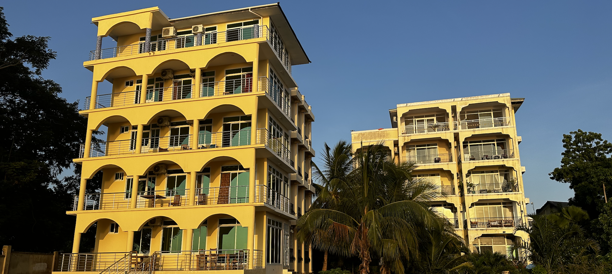

<!-- section 1 -->

 

 ## OurParadise: Zanzibar
 
 ### A Co-Living Community for Change-Makers & Digital Nomads

 On the west coast of Zanzibar sits a beautiful and historical community space for eco-tourism, co-working, and co-living. A place for like-minded people to gather, share authentic moments, and build our future together.

  <button>[Dive Deeper](/about)</button>
  <button>[Support the Project](/action)</button>



<!-- section 2  -->



## Karibu Zanzibar

### "Karibu" means **"Welcome (to)"** in Swahili

Discover authentic paradise. Just ten minutes from world heritage site Stone Town, as well as the international airport.





#### **Jungle Paradise** @ Mbweni Ruins

For short term stays. A beachfront hotel that sits beside historical ruins, all surrounded by beautiful lush gardens featuring a wide variety of native and exotic plants.

 <button>[Info](/location/mbweni)</button>
 <button>[Stay](https://hotels.cloudbeds.com/reservation/DNw5Ek)</button>

|||

#### **Seaview Apartments**

For long-term stays. Two apartment buildings, with four three-bedroom spaces and one rooftop penthouse each. Private beach and direct access to Jungle Paradise.

 <button>[Info: Coming Soon]()</button>
 <button>[Stay: Coming Soon]()</button>





#### **OurOffice**

A three-floor office space perfect for co-working and collaboration. Conveniently located just next to Jungle Paradise and Seaview Apartments.

 <button>[Info: Coming Soon]()</button>

|||

#### **Chumbe Island** (Friends of the Project)

An award-winning private nature reserve, home to one of the world's most pristine coral reef sanctuaries. Day trips leave to Chumbe each day from our property.

<button>[Info](/location/chumbe)</button>

