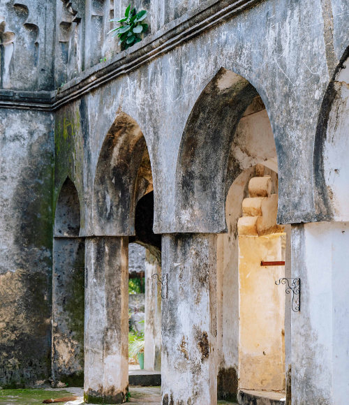



## Take a Look Back

### A Story Tied to Freedom

With roots back to the abolition of slavery in the region, the land on which we stand is very special. We are proud to have the opportunity to call this place home.

 
 
 
 
 
 





John Kirk was the only companion of explorer David Livingstone to emerge untainted from the disastrous, tragic expedition up the Zambezi river between 1859 and 1863. Three years later, Kirk returned to Africa, to the notorious island of Zanzibar, ancient post of the slave trade between Africa and the Middle East.

Half a century after the abolition of slavery in Britain, slave trafficking persisted on Africa's east coast, apparently tolerated and even connived with by parts of the British Empire in the Indian Ocean. Kirk, appointed as medical officer to the British Consulate in Zanzibar, could do nothing.

There is a book which describes the horrors of the overland passage from the interior, and the Zanzibar slave market itself, together with Kirk's final, bitter conflict with Livingstone, who blamed Kirk for his own failings. But it was Kirk's success in closing down the slave trade on the island which made him famous across the world. Using private diaries and papers, a long forgotten Victorian hero and an extraordinary chapter in British history are revived in detail.

|||





As a naturalist Kirk took high rank, and many species of the flora and fauna of Central Africa were made known by him, and several bear his name, e.g. the Otogale kirkii (a lemuroid), the Madoqua kirkii (a diminutive antelope), the Landolphia kirkii and the Clematis kirkii. For his services to geography he received in 1882 the patrons' medal of the Royal Geographical Society, of which society he became foreign secretary. Kirk was made K.C.B. (Knight Commander) in 1900.

The twenty-one years spent by Kirk in Zanzibar covered the most critical period of the history of European intervention in East Africa; and during the greater part of that time he was the virtual ruler of the country. With Seyyid Bargash, who became sultan in 1870, he had a controlling influence, and after the failure of Sir Bartle Frere's efforts he succeeded in obtaining (June 5, 1873) the sultan's signature to a treaty abolishing the slave trade in his dominions. In 1877 Bargash offered to a British merchant - Sir W. Mackinnon - a lease of his mainland territories, and he gave Kirk a declaration in which he bound himself not to cede territory to any other power than Great Britain, a declaration ignored by the British government.

 <button>[More About the Location](/location)</button>
 <button>[Our Plans to Protect](/protection)</button>

