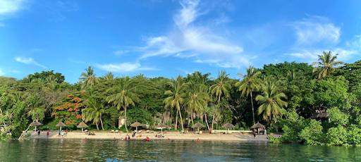
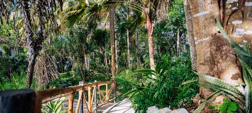
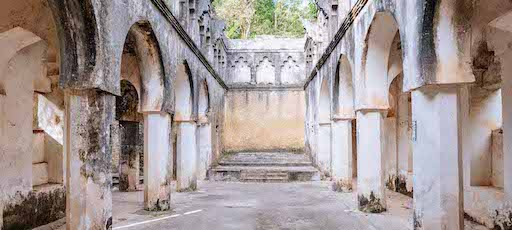
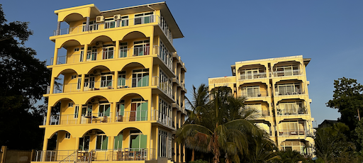

<!-- section 1 (Locations) -->



## Our Location

### Discover Authentic Paradise in East Africa

You can find us on the west coast of Zanzibar, alongside 250 meters of mangrove-lined beaches, historic ruins, and lush botanical gardens. Nearby, the world-renowned Chumbe island awaits.

 <button>[Learn the History](/history)</button>

 
 
 
 
 
 





## Karibu Zanzibar

### "Karibu" means **"Welcome (to)"** in Swahili

Discover authentic paradise. Just ten minutes from world heritage site Stone Town, as well as the international airport.





#### **Jungle Paradise**

For short term stays. A beachfront hotel that sits beside historical ruins, all surrounded by beautiful lush gardens featuring a wide variety of native and exotic plants.

 <button>[Info](/location/mbweni)</button>
 <button>[Stay](https://hotels.cloudbeds.com/reservation/DNw5Ek)</button>

|||

#### **Botanical Gardens**

The Gardens here are beautiful and mature with many fine tree specimens and interesting plants, including more than 100 tree and plant species endemic to the island.

<button>[Programs to Protect](/protect)</button>





##### **Mbweni Ruins**

We share space with historic ruins of a school for freed slaves (1874) with associations to Sir John Kirk – who was instrumental in ending the East African Slave Trade.

<button>[Learn the History](/history)</button>

|||

#### **Seaview Apartments**

For long-term stays. Two apartment buildings, with four three-bedroom spaces and one rooftop penthouse each. Private beach and direct access to Jungle Paradise.

 <button>[Info: Coming Soon]()</button>
 <button>[Stay: Coming Soon]()</button>





#### **OurOffice**

A three-floor office space perfect for co-working and collaboration. Conveniently located just next to Jungle Paradise and Seaview Apartments.

 <button>[Info: Coming Soon]()</button>

|||

#### **Chumbe Island** (Friends of the Project)

An award-winning private nature reserve, home to one of the world's most pristine coral reef sanctuaries. Day trips leave to Chumbe each day from our property.

<button>[Info](/location/chumbe)</button>





#### **Healing Center: Coming 2023**

The center will combine advanced regenerative healing practices with ancient and modern wisdom, with a focus on ayurveda.

<button>[Info: Coming Soon]()</button>

|||

