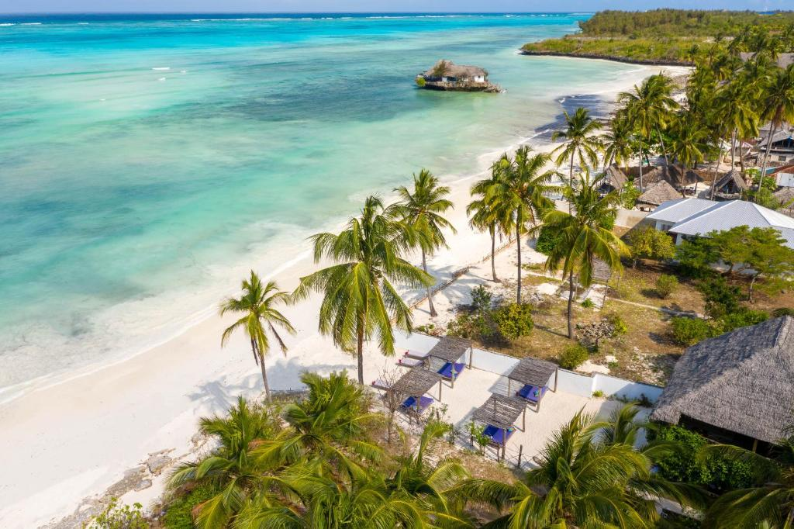
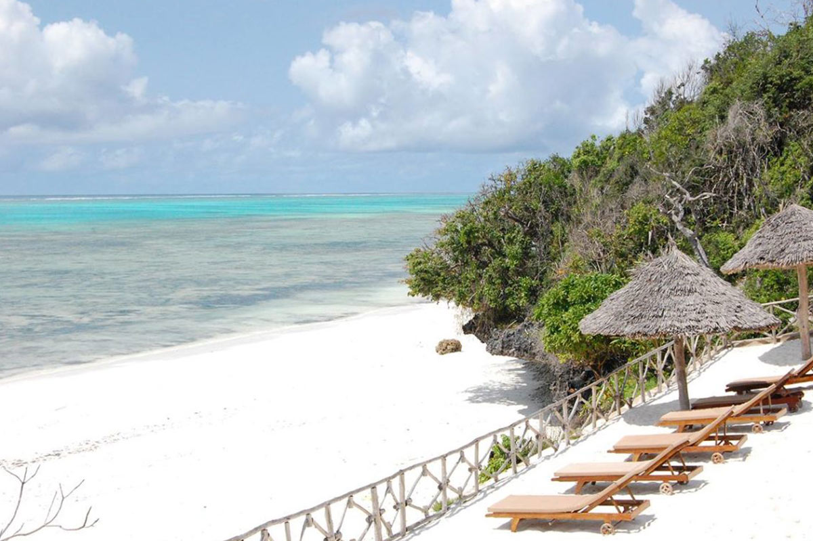
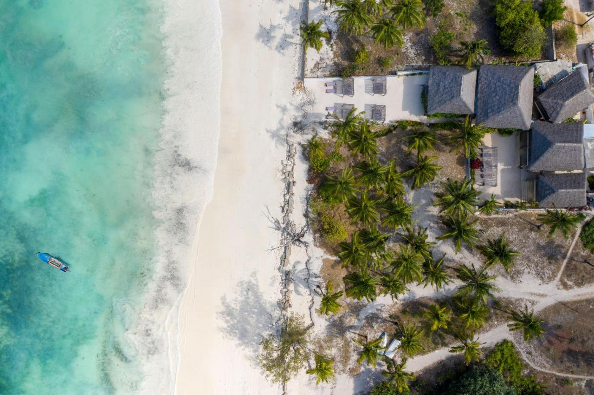

<!-- section 1 (JP) -->



## Michamvi, Tanzania

### Eco-friendly Beach Villas and Apartments at Your Service

 

Zanzibar, in our opinion is one of the most beautiful locations in the world with friendly tropical climate and preserved nature surroundings, we are acquiring  some remaining beautiful beach plots in Michamvi, Zanzibar, what would be home for designated ecofriendly OurParadise beach villas and apartments.



<!-- section 1 (JP) -->


### Michamvi Beach Villa and Resorts





|||

|||





Michamvi is an amazing location on the Island, it has incredible hotels around and stunning beaches.
The inner side (left side) at low tide, gives room for a huge beach with absolute white sand. 
It's also home to amazing mangroves, just next to our location, the location is absolutely stunning.
We have +-20.000m2 at the beach, and 10.000m2 on a hilltop with amazing views of the sea around. 
This is an amazing place to live parts of the year or relax after a stay at our healing clinic or resort on the other side of the island.

|||





|||

Activities in our OUR-PARADISE Beach Villa Resort: 
- Local Sailing Boats with captains to teach us how to sail. 
- Canoes for the Mangroves 
- Kitesurfing and Windsurfing Boards (with instructors) 
- And last but not least, sailing training in an incredible Trimaran. 





<button>[See Other Locations](/locations)</button>

