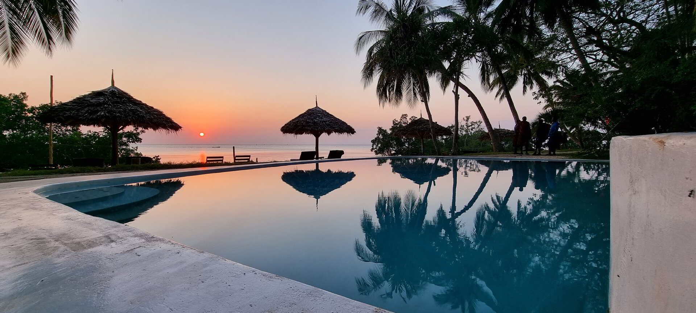

<!-- section 1 (JP) -->



## Jungle Paradise

### Eco-friendly Boutique Resort

 

Enjoy the Jungle Paradise beach resort Zanzibar, a hotel with ocean view suites, cocktails at the beach, with a romantic dinner in the restaurant and a sunset beach club.





### More About Jungle Paradise



<!-- section 0 (JP) -->



|||

|||



<!-- section 2 (JP) -->



|||

Jungle Paradise Beach Resort & Spa at Mbweni Ruins is your ideal choice, if you want to see and enjoy a unique place in Zanzibar Urban West. It's well-known for their historical Mbweni ruins, which took part in the ending of slavery in Zanzibar in the 1870s. Jungle Paradise is surrounded by a beautiful botanic garden which supported over 600 different kinds of tree species. 





Jungle paradise Beach Resort and Spa features 13 exclusive and cozy, air-conditioned beachfront Suites with a very high service standard. Each room provides a beautiful ocean-view, a private bathroom, Wi-Fi, a flat screen HD-TV with cable channels, a mini bar fridge and a balcony faced to the ocean, beach and pool area.

|||



<!-- section 2 (JP) -->



|||

You will enjoy a tasty menu in our “Ocean Breeze” Restaurant while listening to calm chill out vibes and watching one of the best sunsets on this side of the island. After the sun downer, you dig into the evening with entertainment based on several themes and artists and a variety of cocktails mixed at our “JP’s Beach Bar”. You will find us 7 minutes close to the airport and 12 minutes from Stone town. We provide a free pickup for you. This could be one of your best and memorable stay on Zanzibar.





<button>[See More Locations](/locations)</button>

